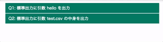
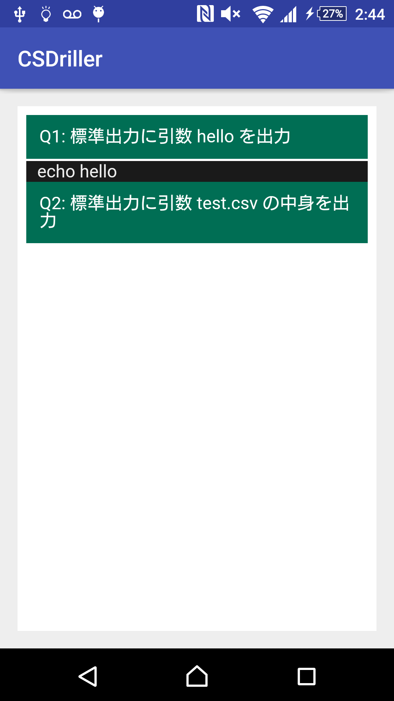

## CSDriller

問いと答えを交互にCSVを書いて、簡単なドリルを作成することができるスクリプトとAndroid端末でそれを閲覧するための簡単なアプリです。

## 使い方

```sh
# CSVからドリルとして使用出来るHTMLを生成
$ ruby generator/generator.rb input.csv > drill.html

# Android アプリで閲覧するためにアプリのassetsディレクトリへコピー
$ cp drill.html cp drill.html CSDriller/app/assets/drill.html
```

生成されるHTMLをGoogle Chromeで閲覧した場合の様子は



それをモバイルで見た場合の様子は



となります。

このドリル用HTMLは[@takanorip](https://github.com/takanorip)さんの[こちらの記事](https://qiita.com/takanorip/items/217f9c29715825de0fdc)のCSSを利用させていただきました。ありがとうございます。
